  <picture>
    <source media="(prefers-color-scheme: dark)" srcset="assets/hero-dark.svg" />
    <source media="(prefers-color-scheme: light)" srcset="assets/hero-light.svg" />
    
  </picture>

  <a href="https://www.linkedin.com/in/wesley-luther-dev/">LinkedIn</a>
  ·
  <a href="mailto:wesleyluther830@gmail.com">wesleyluther830@gmail.com</a>
  ·
  <a href="https://briaspas-scale.vercel.app">Briaspas Scale</a>

Construo interfaces com hierarquia, tipo e cor — React, TypeScript e CSS — e publico o que dá para abrir e avaliar. Estudante de Engenharia de Software. Aberto a estágio de front-end, remoto ou híbrido.

<picture>
  <source media="(prefers-color-scheme: dark)" srcset="assets/produto-dark.svg" />
  <source media="(prefers-color-scheme: light)" srcset="assets/produto-light.svg" />
  
</picture>

[Abrir produto](https://briaspas-scale.vercel.app) · [Código](https://github.com/Asapx380/briaspas-scale)

<picture>
  <source media="(prefers-color-scheme: dark)" srcset="assets/trabalho-dark.svg" />
  <source media="(prefers-color-scheme: light)" srcset="assets/trabalho-light.svg" />
  
</picture>

  <a href="https://cambio64.netlify.app/">Demo câmbio64</a> · <a href="https://github.com/Asapx380/currency-converter">Código</a>
  &nbsp;·&nbsp;
  <a href="https://sorteio-kit-natura-ibpm.netlify.app/">Demo Sorteio Pix</a> · <a href="https://github.com/Asapx380/pix-raffle-web">Código</a>
  &nbsp;·&nbsp;
  <a href="https://forjaai.netlify.app/">Demo Forja AI</a> · <a href="https://github.com/Asapx380/ai-landing-page-generator">Código</a>

Contribuições no GitHub — a cobrinha percorre a grade.

  <picture>
    <source media="(prefers-color-scheme: dark)" srcset="https://raw.githubusercontent.com/Asapx380/Asapx380/output/github-contribution-grid-snake-dark.svg" />
    <source media="(prefers-color-scheme: light)" srcset="https://raw.githubusercontent.com/Asapx380/Asapx380/output/github-contribution-grid-snake.svg" />
    
  </picture>

  <a href="https://www.linkedin.com/in/wesley-luther-dev/">LinkedIn</a>
  ·
  <a href="mailto:wesleyluther830@gmail.com">wesleyluther830@gmail.com</a>

